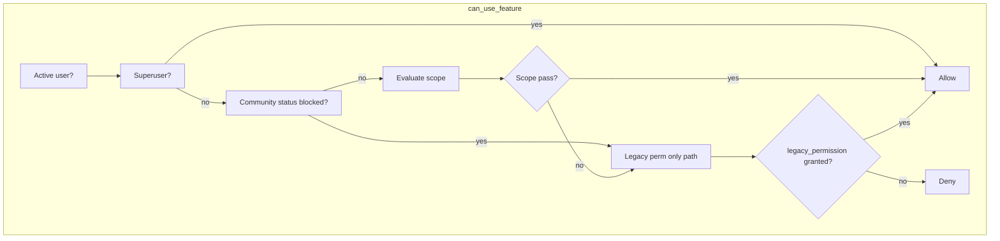
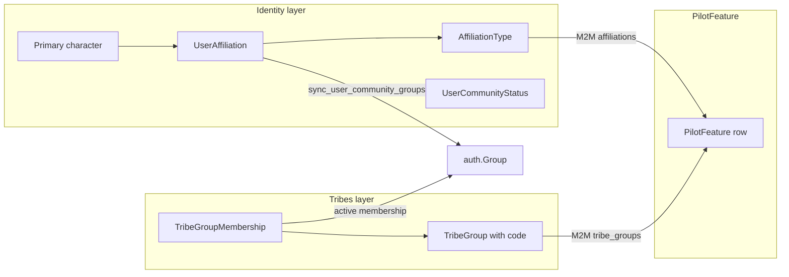
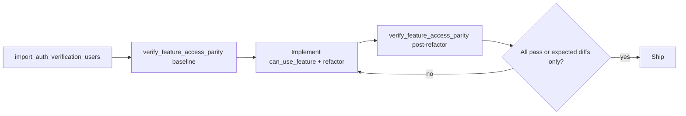

# PilotFeature Authorization System

## Goals

- Replace scattered `user.has_perm(...)` checks with one evaluator: [`groups/helpers/feature_access.py`](backend/groups/helpers/feature_access.py).
- Keep **full backwards compatibility**: users who still receive capabilities via Alliance (or other) auth-group Django perms continue to work until those perms are stripped.
- **Do not** add `features` to [`UserProfileSchema`](backend/users/schemas.py) or change frontend gating ([`frontend/app/src/helpers/permissions`](frontend/app/src/helpers/permissions)) in this work.
- Mirror the existing tribe catalog pattern: **code registry** (source of truth for what exists) + **DB rows** (admin wiring to `AffiliationType` / `TribeGroup`).

---

## Concepts

### Feature (catalog) vs PilotFeature (DB row)

| Term | What it is | Where it lives |
|------|------------|----------------|
| **Feature** | Stable capability identified by `code` (e.g. `fleets.view`, `tribes.apply`) | [`groups/features/registry.py`](backend/groups/features/registry.py) |
| **FeatureDefinition** | Immutable metadata: label, `scope`, optional `legacy_permission`, optional `staff_permission`, default wiring hints | Registry dataclass |
| **PilotFeature** | Mutable DB row synced from registry; admins wire M2M affiliations, tribe groups, auth groups | [`groups/models.py`](backend/groups/models.py) |

The registry defines **what features exist and how they are evaluated**. `PilotFeature` rows hold **who gets them** (affiliation/tribe/group wiring) plus optional staff permission codenames for operations staff.

### FeatureScope (evaluation strategies)



| Scope | Meaning | Context kwargs |
|-------|---------|----------------|
| `affiliation` | User's `UserAffiliation.affiliation` is in feature's M2M | — |
| `tribe_membership` | Active `TribeGroupMembership` in any wired `TribeGroup` | optional `tribe_group` |
| `tribe_group_target` | Like `tribe_membership`, but also requires target group in wired set (for apply) | `tribe_group` required |
| `tribe_chief` | User is `Tribe.chief`, `TribeGroup.chief`, or holds staff perm on feature | optional `tribe`, `tribe_group` |
| `resource_match` | User's effective auth groups overlap resource audience groups | `fleet` (EveFleet) |
| `auth_group` | User is in any wired named `auth.Group` | — |
| `staff` | User has `staff_permission` on the PilotFeature row (or legacy fallback) | — |

**Backwards-compat rule (critical):** for non-superusers, access is granted if **either** scope evaluation passes **or** `legacy_permission` is held. This preserves today's Alliance-group behavior while new affiliation wiring can grant access independently (e.g. Associate without Django perms).

**Community status:** `on_leave` denies affiliation-scoped features at the scope layer (legacy may still grant staff capabilities—intentional during migration). `trial` does not block by default (matches current Alliance+Trial behavior).

---

## TribeGroup and AffiliationType interactions



- **AffiliationType** answers "what bucket is this pilot in?" (`Alliance`, `Militia`, `Guest`, `Associate` in prod). Features with `scope=affiliation` check `UserAffiliation` against the feature's wired affiliations—not auth-group membership directly.
- **TribeGroup.code** (stable keys from [`fixtures/data/06_tribes.json`](backend/fixtures/data/06_tribes.json), same pattern as [`tribes/reports/registry.py`](backend/tribes/reports/registry.py)) answers "which tribe subgroup matters?" Used for:
  - `tribes.apply` → `tribe_group_target` (which groups can be applied to; default: all active groups)
  - `industry.order.submit` → `tribe_chief` (default tribe group codes prefixed `industry.`)
  - `tribes.manage_memberships` → `tribe_chief` (any group in tribe being managed)
- **Auth groups remain the Discord/sync hub** ([`groups/helpers.py`](backend/groups/helpers.py) `sync_user_community_groups`, [`tribes/signals.py`](backend/tribes/signals.py)). PilotFeature does not replace them; it sits above for product authorization.
- **Offboarding:** replace [`remove_tribe_members_without_permission`](backend/tribes/tasks.py) (`tribes.add_tribegroupmembership` check) with `not can_use_feature(user, "tribes.apply")`. Optionally add immediate offboard in [`groups/signals.py`](backend/groups/signals.py) `user_affiliation_post_save` / `pre_delete` calling a small `offboard_tribe_memberships_without_feature(user)` helper (Celery task remains as safety net).

---

## Data model

Add to [`backend/groups/models.py`](backend/groups/models.py):

```python
class PilotFeature(models.Model):
    code = models.CharField(max_length=64, unique=True)
    label = models.CharField(max_length=128)
    description = models.TextField(blank=True)
    scope = models.CharField(max_length=32, choices=FeatureScope.choices)
    legacy_permission = models.CharField(max_length=100, blank=True, default="")
    staff_permission = models.CharField(max_length=100, blank=True, default="")
    affiliations = models.ManyToManyField(AffiliationType, blank=True)
    tribe_groups = models.ManyToManyField("tribes.TribeGroup", blank=True)
    auth_groups = models.ManyToManyField("auth.Group", blank=True)
    deny_community_statuses = models.JSONField(default=list)  # e.g. ["on_leave"]
    is_active = models.BooleanField(default=True)
```

Add [`backend/groups/features/registry.py`](backend/groups/features/registry.py) with `FEATURE_DEFINITIONS: dict[str, FeatureDefinition]` and initial catalog:

| code | scope | legacy_permission | Default wiring (sync seeds by name/code) |
|------|-------|-------------------|------------------------------------------|
| `tribes.apply` | `tribe_group_target` | `tribes.add_tribegroupmembership` | affiliations: Alliance, Associate |
| `tribes.manage_memberships` | `tribe_chief` | `tribes.change_tribegroupmembership` | — |
| `fleets.view` | `resource_match` | `fleets.view_evefleet` | affiliations: Alliance, Militia, Associate |
| `fleets.create` | `affiliation` | `fleets.add_evefleet` | affiliations: Alliance |
| `fleets.delete` | `staff` | `fleets.delete_evefleet` | staff: `fleets.delete_evefleet` |
| `srp.view` | `affiliation` | `srp.view_evefleetshipreimbursement` | affiliations: Alliance, Militia |
| `srp.submit` | `resource_match` | *(none)* | affiliations: Alliance (+ Militia when ready) |
| `srp.resolve` | `staff` | `srp.add_evefleetshipreimbursement` | |
| `srp.process` | `staff` | `srp.change_evefleetshipreimbursement` | |
| `structures.view` | `affiliation` | `structures.view_evestructure` | affiliations: Alliance, Associate |
| `structures.timers.view` | `affiliation` | `structures.view_evestructuretimer` | affiliations: Alliance, Associate |
| `structures.timers.manage` | `affiliation` | `structures.add_evestructuretimer` | affiliations: Alliance |
| `mumble.access` | `affiliation` | `mumble.view_mumbleaccess` | affiliations: Alliance, Associate |
| `moons.view` | `affiliation` | `moons.view_evemoon` | affiliations: Alliance |
| `moons.manage` | `staff` | `moons.add_evemoon` | |
| `posts.create` | `affiliation` | `posts.add_evepost` | affiliations: Alliance |
| `posts.edit` | `affiliation` | `posts.change_evepost` | affiliations: Alliance |
| `posts.delete` | `affiliation` | `posts.delete_evepost` | affiliations: Alliance |
| `industry.mining.view` | `affiliation` | `industry.view_miningupgradecompletion` | affiliations: Alliance |
| `industry.mining.submit` | `affiliation` | `industry.add_miningupgradecompletion` | affiliations: Alliance |
| `industry.order.submit` | `tribe_chief` | *(none)* | tribe_groups: all `industry.*` codes |
| `applications.manage` | `staff` | `applications.change_evecorporationapplication` | |
| `applications.view` | `staff` | `applications.view_evecorporationapplication` | |
| `characters.view_staff` | `staff` | `eveonline.view_evecharacter` | |
| `characters.delete_staff` | `staff` | `eveonline.delete_evecharacter` | |
| `tech.ops` | `auth_group` | *(none)* | auth_groups: Technology Team |
| `fittings.doctrine.approve` | `staff` | tier-specific legacy perms | delegate to existing tier helpers |
| `fittings.doctrine.propose` | `staff` | tier-specific legacy perms | delegate to existing tier helpers |

Add management command [`sync_pilot_features`](backend/groups/management/commands/sync_pilot_features.py):
- Upsert `PilotFeature` rows from registry (update label/scope/legacy/staff fields).
- Seed default M2M **only when empty** (preserve admin overrides).
- Log missing `AffiliationType` / `TribeGroup` names (e.g. Associate not in dev fixtures yet).

Register in Django admin ([`groups/admin.py`](backend/groups/admin.py)): list/filter by scope; M2M widgets for affiliations and tribe groups; read-only `code`.

---

## Single utility API

[`backend/groups/helpers/feature_access.py`](backend/groups/helpers/feature_access.py):

```python
def can_use_feature(
    user,
    code: str,
    *,
    tribe: Tribe | None = None,
    tribe_group: TribeGroup | None = None,
    fleet: EveFleet | None = None,
    allow_legacy: bool = True,
) -> bool: ...

def require_feature(user, code: str, **context) -> tuple[int, dict] | None:
    """Return None if allowed, else (403, {"detail": "feature_denied", "feature": code})."""

def user_affiliation(user) -> AffiliationType | None: ...
def user_community_status(user) -> str | None: ...
```

Implementation notes:
- Cache `PilotFeature` row + M2M prefetches per request thread (simple `lru_cache` on code or module-level dict cleared per test).
- `_evaluate_scope()` dispatches on `feature.scope`.
- `_resource_match(fleet)`: `fleet.audience.groups` ∩ user's `user.groups.all()` non-empty OR user's affiliation auth group in audience groups.
- Refactor [`_fleet_authorized`](backend/fleets/endpoints/helpers.py) to: `can_use_feature(..., "fleets.view", fleet=fleet) OR user == fleet.created_by`.
- Refactor [`tribes/helpers/permissions.py`](backend/tribes/helpers/permissions.py) to call `can_use_feature` for the staff/chief parts of `user_is_tribe_chief` / `user_can_manage_group` (chief ID checks stay; perm checks become feature checks).
- Refactor [`onboarding/srp_gate.py`](backend/onboarding/srp_gate.py) `bypass_srp_onboarding` to use `can_use_feature(user, "srp.process")` instead of raw `has_perm`.
- Keep **owner-scoped** logic (SRP own request, post author, fleet creator delete) as a second layer **after** base feature check in endpoint helpers—not inside `can_use_feature`.

Thin wrappers for Ninja endpoints (optional, reduces boilerplate):

```python
def check_feature(request, code, **ctx):
    if not can_use_feature(request.user, code, **ctx):
        return require_feature(request.user, code, **ctx)
    return None
```

---

## Backend refactor inventory

Replace direct `has_perm` / duplicated `user_has_perm` with `can_use_feature` / `require_feature`:

**Tribes**
- [`post_membership.py`](backend/tribes/endpoints/memberships/post_membership.py) — add `tribes.apply` gate (currently open)
- [`tribes/helpers/permissions.py`](backend/tribes/helpers/permissions.py)
- [`tribes/tasks.py`](backend/tribes/tasks.py) — offboarding task

**Fleets** — all files using `fleets.view_evefleet` / `fleets.add_evefleet` / `fleets.delete_evefleet` under [`backend/fleets/endpoints/`](backend/fleets/endpoints/)

**SRP** — [`backend/srp/endpoints/`](backend/srp/endpoints/) + [`combatlog/router.py`](backend/combatlog/router.py) `is_srp_admin` → `srp.process`

**Structures, mumble, moons, posts, industry mining** — respective routers/endpoints

**Applications** — [`applications/router.py`](backend/applications/router.py)

**Eveonline staff character endpoints** — 4 character endpoints

**Tech** — [`tech/router.py`](backend/tech/router.py) `permitted()` → `can_use_feature(..., "tech.ops")`

**Fittings** — [`fittings/helpers/permissions.py`](backend/fittings/helpers/permissions.py): each `can_*` function checks feature first, then legacy tier perm (or map tiers to sub-features)

**Admin custom views** — refactor duplicated `user_has_perm` in `*/helpers/admin_permissions.py` to call `can_use_feature` where a matching staff feature exists; keep `PermissionDenied` raising pattern. Apps: tribes, industry, onboarding, help_tickets, fittings, market, freight.

**Mumble task** — [`mumble/tasks.py`](backend/mumble/tasks.py)

Do **not** change [`users/helpers.py`](backend/users/helpers.py) `get_user_permissions` — frontend continues using Django permission strings.

---

## Documentation

Create [`docs/authorization.md`](docs/authorization.md) covering:

### Backend
- Layer diagram: Authentication (JWT) → PilotFeature evaluation → optional owner/resource gates → optional program gates (SRP onboarding).
- How to gate a new endpoint: pick feature code, call `require_feature`, document context kwargs.
- How to add a new feature: registry entry → `sync_pilot_features` → wire affiliations in admin → tests.
- Backwards-compat migration path: strip `legacy_permission` from registry rows once Alliance group perms removed.
- **Local parity verification:** `import_auth_verification_users` + `verify_feature_access_parity` workflow (requires `production_readonly`); reports are gitignored; not used in CI unless anonymized snapshot is added later.

### Frontend (no code changes in this PR)
- Continues to fetch `permissions` from `GET /api/users/me` ([`users/router.py`](backend/users/router.py)).
- Page-level checks via `user_permissions.includes('app.codename')` remain valid during migration.
- Future: optional `features: string[]` field—explicitly out of scope; document as planned follow-up.

### Administration panel
- **PilotFeature admin**: wire affiliations and tribe groups per feature.
- **AffiliationType admin**: unchanged; drives identity, not product perms directly.
- **Auth Group admin**: still used for Discord roles; Django perms on Alliance group remain until deliberately removed.
- **Tribe/TribeGroup admin**: chiefs and Discord groups unchanged; membership approve flow still chief-driven.

Update [`backend/README.md`](backend/README.md) with a link to `docs/authorization.md` and `sync_pilot_features` deploy step.

---

## Production parity verification (local, anonymized)

Before and after the endpoint refactor, verify that `can_use_feature()` produces the **same allow/deny outcomes** as today's authorization for real production user shapes. This is a **manual maintainer workflow**, not committed test data.

### User archetype catalog

Add [`backend/groups/features/verification_archetypes.py`](backend/groups/features/verification_archetypes.py) — code-defined archetypes (like the feature registry), each describing how to find **one** representative user in `production_readonly`:

| Archetype code | Selection criteria (prod query) |
|----------------|--------------------------------|
| `superuser` | `is_superuser=True`, active |
| `staff_direct_perms` | `is_staff=True`, has direct `user_permissions`, not superuser |
| `alliance_active` | `UserAffiliation` → Alliance, `UserCommunityStatus` → active |
| `alliance_trial` | Alliance affiliation + trial status |
| `alliance_on_leave` | on_leave status (no affiliation group on user) |
| `associate_active` | Associate affiliation + active (skip with warning if none in prod) |
| `militia_active` | Militia affiliation + active |
| `guest_default` | Guest/default affiliation only |
| `tribe_chief` | `Tribe.chief` set, active |
| `tribe_group_chief` | `TribeGroup.chief` set, not tribe chief |
| `tribe_member_active` | active `TribeGroupMembership`, Alliance-backed |
| `tribe_member_pending` | pending membership |
| `tribe_member_inactive` | inactive membership (was member, offboarded) |
| `srp_processor` | holds `srp.change_evefleetshipreimbursement` (non-superuser if possible) |
| `fleet_commander` | holds `fleets.add_evefleet` via Alliance group |
| `tech_team` | member of Technology Team auth group |
| `people_team` | member of People Team auth group (skip if group absent) |
| `no_primary_character` | no `UserAffiliation`, no primary character |

Archetypes are resolved at import time; store the **prod user pk** only in a local mapping file (gitignored), not in the repo.

### Import command (anonymized)

Add [`import_auth_verification_users`](backend/groups/management/commands/import_auth_verification_users.py) (pattern: [`import_posts_from_production`](backend/posts/management/commands/import_posts_from_production.py)):

```bash
pipenv run python manage.py import_auth_verification_users --source production_readonly
pipenv run python manage.py import_auth_verification_users --dry-run  # preview archetype matches
```

**Reads** from `production_readonly`; **writes** only to `default`.

**Per archetype, copy effective auth state (not full EVE identity):**

- `auth.User` — anonymized username `auth_verify_<archetype>` (e.g. `auth_verify_alliance_active`), blank email, preserve `is_staff` / `is_superuser` / `is_active`
- `UserAffiliation`, `UserCommunityStatus`
- `user.groups` M2M (Affiliation, Trial, On Leave, tribe Discord groups, team groups)
- `user.user_permissions` direct grants
- `TribeGroupMembership` rows (status, tribe_group FK resolved by `TribeGroup.code`)
- Optional: `Tribe.chief` / `TribeGroup.chief` FKs pointed at imported users where archetype requires it

**Never copy:** Discord IDs, real emails, character names, tokens, killmails, or other PII. Do not copy `EveCharacter` rows unless a minimal stub is required (prefer affiliation/group copy alone).

**Gitignore:** add `.auth_verification_import.json` (archetype → local user pk map) and any generated report output under `backend/.local/` or similar.

**Not for automated tests:** this import is for local maintainer verification only. Do not reference prod usernames or prod pks in `test_*.py`.

### Parity verification command

Add [`verify_feature_access_parity`](backend/groups/management/commands/verify_feature_access_parity.py):

```bash
pipenv run python manage.py sync_pilot_features
pipenv run python manage.py import_auth_verification_users
pipenv run python manage.py verify_feature_access_parity --output .local/auth_parity_report.md
```

For each imported archetype × each feature in the registry:

1. Compute **baseline** using today's logic (the `has_perm(legacy_permission)` check, or the existing domain helper where there is no single perm — e.g. `_fleet_authorized`, `user_can_manage_group`, `permitted()` for tech).
2. Compute **candidate** via `can_use_feature(user, code, **context)`.
3. Record match/mismatch with feature code, archetype, baseline source, and both boolean results.

**Context fixtures for scoped features** (imported or synthesized locally, not from prod PII):

- `resource_match` (`fleets.view`, `srp.submit`): one fleet per audience type from reference fixtures / prod audience **structure only** (group IDs remapped to local auth groups by name)
- `tribe_group_target` (`tribes.apply`): use a wired `TribeGroup` from `06_tribes.json`
- `tribe_chief` (`tribes.manage_memberships`, `industry.order.submit`): pass the archetype user's chief context

**Exit code non-zero** if any mismatch. Expected mismatches (intentional improvements, e.g. new `tribes.apply` gate on currently-open apply endpoint) must be listed in an `EXPECTED_DIFFERENCES` dict in the verifier with a one-line rationale; everything else must pass.

### Verification gates in rollout



1. **Baseline capture** — run parity verifier *before* endpoint refactor; save report as reference (local only).
2. **Post-refactor** — re-run; only documented `EXPECTED_DIFFERENCES` may change (e.g. `tribes.apply` newly denies Guest).
3. **Regression** — re-run after stripping legacy perms (future effort); scope checks must pass without legacy fallback.

---

## Testing (synthetic only)

Add [`backend/groups/tests/test_feature_access.py`](backend/groups/tests/test_feature_access.py) using **factory-built users** (same patterns as [`groups/tests/test_tasks.py`](backend/groups/tests/test_tasks.py)) — no production data, no prod usernames:

- Legacy-only grant (user in Alliance auth group with perm, empty PilotFeature M2M)
- Affiliation-only grant (wired PilotFeature, user without legacy perm)
- Denied when neither passes
- `on_leave` blocks affiliation scope
- `resource_match` with fleet audience groups
- `tribe_chief` and `tribe_group_target` scopes
- `sync_pilot_features` idempotency and preserve-admin-wiring

Update affected endpoint tests (tribes apply, fleets, srp) to assert feature denial responses.

Run: `pipenv run python manage.py test groups tribes fleets srp --settings=app.settings_test`

**Optional later:** commit an anonymized, hand-reviewed snapshot for CI only if we add a separate `test_feature_access_from_snapshot.py` that reads a checked-in `fixtures/data/11_auth_verification_users.json` with zero PII — out of scope for initial implementation.

---

## Rollout sequence

1. Ship model + registry + `sync_pilot_features` + `can_use_feature` (no endpoint changes).
2. **Baseline verification:** `import_auth_verification_users` → `verify_feature_access_parity` → save local report.
3. Refactor endpoints + tasks + admin helpers; add `tribes.apply` gate on apply endpoint.
4. **Post-refactor verification:** re-run parity command; confirm only `EXPECTED_DIFFERENCES` differ.
5. Deploy: run `sync_pilot_features` after migrate; verify Alliance users unchanged (legacy path).
6. Admin: wire Associate (and other buckets) on features without waiting for Alliance perm strip.
7. Later (separate effort): remove Django perms from Alliance group in fixtures/prod; remove `legacy_permission` fields from registry entries one feature at a time; re-run parity with `allow_legacy=False`.

---

## Out of scope (explicit)

- Exposing `features` on user API or frontend migration
- Removing Django perms from Alliance auth group
- Creating People Team / SRP Team auth groups (document as follow-up)
- Changing Discord role sync behavior
- Committing production user data or parity reports to the repo (local/gitignored only unless later anonymized snapshot is explicitly reviewed)
