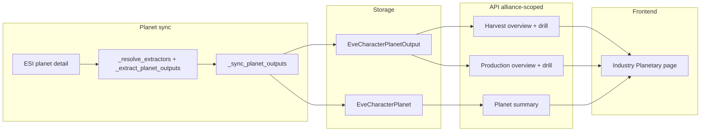

# Planetary interaction alliance feature

## Scope and data flow

- **Alliance scope**: Restrict all data to characters whose `alliance_id` is in `EveAlliance.objects.values_list("alliance_id", flat=True)` (same pattern as [market/helpers/contract_fetch.py](backend/market/helpers/contract_fetch.py) and [eveonline/models/characters.py](backend/eveonline/models/characters.py) skillset filter).
- **Existing data**: [EveCharacterPlanet](backend/eveonline/models/characters.py) (character, planet_id, solar_system_id, etc.) and [EveCharacterPlanetOutput](backend/eveonline/models/characters.py) (planet, eve_type, output_type=harvested|produced, daily_quantity). Planet sync in [eveonline/helpers/characters/planets.py](backend/eveonline/helpers/characters/planets.py) computes harvested/produced from ESI planet detail but does **not** persist extractor count or factory count; only `daily_quantity` is stored.

To support "count of extractors per P0" and "count of factories (top-level only)", the sync must be extended to compute and store these counts.

---

## 1. Harvest summary

**Goal**: Global overview (count of harvesters per P0 product) and drill-down (list of people harvesting that P0).

- **P0 products**: Types that can be harvested (raw PI). Use [IndustryProduct](backend/industry/models/product.py) with `strategy=Strategy.HARVESTED`, or derive from distinct `eve_type_id` in `EveCharacterPlanetOutput` where `output_type=harvested` (alliance-scoped).
- **Extractor count**: Currently we only store `daily_quantity` per (planet, type, harvested). We need **extractor count** per (planet, P0 type). That requires changing the planet sync to count extractor pins per `product_type_id` and persist that.

**Backend**:

- Add nullable `extractor_count` to `EveCharacterPlanetOutput` (used only when `output_type=harvested`). Migration + backfill (existing rows can stay NULL or 0).
- In [eveonline/helpers/characters/planets.py](backend/eveonline/helpers/characters/planets.py): extend `_resolve_extractors` to also return `extractor_counts: dict[type_id, int]` (count of pins with `extractor_details` per `product_type_id`). In `_sync_planet_outputs`, accept and store `extractor_count` per harvested type (and pass it from `update_character_planets`).
- New industry (or eveonline) endpoints, alliance-filtered:
  - **Overview**: For each P0 type (from IndustryProduct strategy=harvested or from alliance PI data), return `type_id`, `name`, `total_extractors`, optional `total_daily_quantity`. Query: `EveCharacterPlanetOutput` with `output_type=harvested`, `planet__character__alliance_id__in=alliance_ids`, aggregate `Sum('extractor_count')` per `eve_type_id`.
  - **Drill-down**: For a given P0 `type_id`, return a list of entries. Each entry has: **primary_character** (`character_id`, `character_name` — the user's primary), **actual_character** (`character_id`, `character_name` — the character that has the extractors), plus `extractor_count` and optionally `daily_quantity`. Use external EVE character ID and character name for both. One row per (actual character, planet/output); primary is included for grouping and display.

**Frontend**:

- New page/section (e.g. under `/industry/planetary` or `/industry/pi`). Layout similar to [industry/products.astro](frontend/app/src/pages/industry/products.astro): list/tiles of P0 products with total extractor count and a link/button to "Who is harvesting this" (drill-down). Drill-down: list of character names and their extractor count (and optionally daily output).

---

## 2. Production summary

**Goal**: Visualize factories per product type, counting only **end-result** factories (if P2 feeds P3 on the same planet, exclude the P2 factory and count only the P3 factory).

- **Rule (end-result only)**: A factory pin is counted only if its **output type is not used as input by any other factory** on the same planet. So any factory whose output is fed into another factory (e.g. P2 feeding P3) is excluded; we count only factories whose output is not consumed on-planet by another factory (end-result outputs). This is stricter than "net produced": we do not count intermediate factories even if they have surplus; we count only the top of each chain.

- **Implementation**: In `_extract_planet_outputs_with_daily`, after the main resolution loop we have `inbound` (pin_id to routes) and `factory_pin_ids`. Build `types_consumed_by_factories` = set of every `content_type_id` from inbound routes whose **destination** is a factory pin (i.e. types that are consumed as input by some factory). **End-result types** = output types from factory pins that are *not* in `types_consumed_by_factories`. Then `factory_counts[type_id]` = number of factory pins that output that type, only for end-result types. Return `(harvested, produced, extractor_counts, factory_counts)` and extend `_sync_planet_outputs` to accept and store `factory_count` for produced types (only for end-result types; other produced types get 0 or are not stored with a factory_count).

**Backend**:

- Add nullable `factory_count` to `EveCharacterPlanetOutput` (used only when `output_type=produced`). Migration + backfill.
- In `_extract_planet_outputs_with_daily`: after the net-produced step, compute `types_consumed_by_factories` from inbound routes to factory pins; then for each factory pin, if its output type is not in `types_consumed_by_factories`, add 1 to `factory_counts[out_type]`. Return `(harvested, produced, extractor_counts, factory_counts)`. Extend `_sync_planet_outputs` to accept and store `factory_count` for produced types.
- New endpoints, alliance-filtered:
  - **Overview**: For each produced type (from alliance PI data or IndustryProduct produced), return `type_id`, `name`, `total_factories`, optional `total_daily_quantity`. Query: `EveCharacterPlanetOutput` with `output_type=produced`, alliance filter, aggregate `Sum('factory_count')` per `eve_type_id`.
  - **Drill-down**: For a given `type_id`, return a list of entries. Each entry has: **primary_character** (`character_id`, `character_name`), **actual_character** (`character_id`, `character_name`), plus `factory_count` and optionally `daily_quantity`. Use external EVE character ID and character name for both. One row per (actual character, planet/output); primary for grouping and display.

**Frontend**:

- Same PI section: "Production" tab or block. List product types with total factory count; drill-down to see who has factories for that type.

---

## 3. Planet summary

**Goal**: For a given planet (or system), list all alliance members who have a colony there.

- **Backend**: Single endpoint, alliance-filtered: e.g. `GET /api/industry/planetary/planets/?planet_id=40161763` or by `solar_system_id` (and optionally planet_type). Query: `EveCharacterPlanet` with `character__alliance_id__in=alliance_ids`, filter by `planet_id` (and optionally `solar_system_id`). Return a list of entries. Each entry has: **primary_character** (`character_id`, `character_name` — the user's primary), **actual_character** (`character_id`, `character_name` — the character that has the colony). Use external EVE character ID and character name for both. One row per actual character on that planet; primary for grouping (e.g. one user with two alts on same planet yields two rows, each with the same primary and different actual).
- **Frontend**: "Planet summary" in same PI section: planet (or system) selector, then table/list of characters with colonies on that planet. Planet selector could be a search by planet ID or by solar system + dropdown/list of planets that alliance members use.

---

## 4. Implementation details

**Alliance helper**: Centralize "alliance character IDs" in a small helper (e.g. in `eveonline.helpers` or `industry.helpers`) so all three features use the same filter: `EveCharacter.objects.filter(alliance_id__in=EveAlliance.objects.values_list("alliance_id", flat=True)).values_list("character_id", flat=True)`.

**Sync changes** (all in [eveonline/helpers/characters/planets.py](backend/eveonline/helpers/characters/planets.py)):

- `_resolve_extractors`: In the loop over pins with `extractor_details`, maintain `extractor_counts[product_type_id] += 1`. Return `(pin_resolved, node_inflow, harvested, extractor_counts)`.
- `_extract_planet_outputs_with_daily`: After the net-produced step, build `types_consumed_by_factories` from inbound routes to factory pins (all `content_type_id` where destination is in `factory_pin_ids`). Then `factory_counts[type_id] = number of factory pins that output type_id` only for `type_id` not in `types_consumed_by_factories`. Return `(harvested, produced, extractor_counts, factory_counts)`.
- `update_character_planets` / `_sync_planet_outputs`: Pass through and persist `extractor_count` and `factory_count` when creating/updating `EveCharacterPlanetOutput` (harvested rows get extractor_count; produced rows get factory_count).

**Response shape for "who" list endpoints** (harvest drill-down, production drill-down, planet summary): Each item in the list includes **primary_character** and **actual_character**, each with **character_id** (external EVE character ID) and **character_name**. One row per actual character (e.g. per colony or per output); primary is repeated for grouping and display. No internal DB IDs in the response for characters.

**API placement**: Add a sub-router under industry, e.g. `planetary` or `pi`, with routes such as:

- `GET /planetary/harvest` — harvest overview (P0 + total extractors).
- `GET /planetary/harvest/{type_id}` — who harvests this P0 (character + extractor_count).
- `GET /planetary/production` — production overview (type + total factories).
- `GET /planetary/production/{type_id}` — who has factories for this type.
- `GET /planetary/planets` — query params `planet_id` or `solar_system_id`; response: list of characters on that planet (or in that system).

**Frontend structure**: One new page (e.g. `frontend/app/src/pages/industry/planetary.astro` or `pi.astro`) with three sections (Harvest, Production, Planet), reusing layout patterns from [industry/products.astro](frontend/app/src/pages/industry/products.astro) and existing components (tiles, lists, filters). Use existing industry API base and types; add new fetchers and types for the planetary endpoints.

---

## 5. Summary diagram

---

## 6. Optional / later

- **Backfill**: After adding `extractor_count` and `factory_count`, existing rows will be NULL. Options: run a one-off that re-syncs all alliance characters' planets (expensive), or leave NULL and only new syncs populate counts; UI can show "—" or "unknown" when NULL.
- **Tribe scoping**: If you later want "Industry tribe" or a specific tribe group instead of alliance-wide, the same endpoints can accept an optional `tribe_id`/`group_id` and filter by [TribeGroupMembership](backend/tribes/models/tribe_group_membership.py) + [TribeGroupMembershipCharacter](backend/tribes/models/tribe_group_membership.py) instead of alliance_id.
