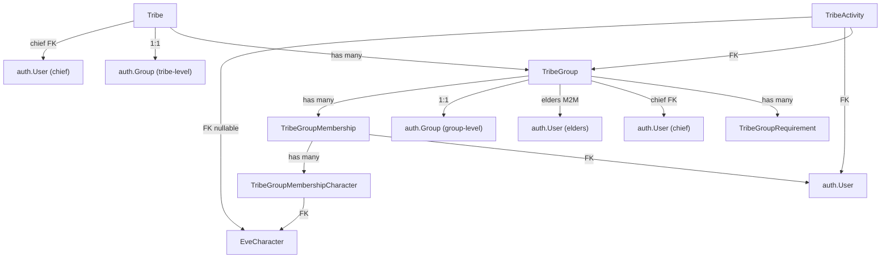

---

name: Tribes App Overhaul
overview: Create a new `tribes` Django app alongside the existing `groups` app. Six models: Tribe, TribeGroup, TribeGroupRequirement, TribeGroupMembership, TribeGroupMembershipCharacter, TribeActivity. No points system — metrics shown as raw quantities relevant to each tribe. Teams and SIGs left in place; phasing them out is deferred.
todos:

- id: create-app
content: "Create the `tribes` Django app with `models.py` containing all 7 models: Tribe, TribeGroup, TribeGroupRequirement, TribeGroupMembership, TribeGroupMembershipCharacter, TribeActivity, TribeGroupOutreach"
status: pending
- id: admin
content: Create `admin.py` with admin classes for all models (TribeGroup inline on Tribe, TribeGroupRequirement inline on TribeGroup, TribeGroupMembershipCharacter inline on TribeGroupMembership)
status: pending
- id: signals
content: "Create `signals.py` — on TribeGroupMembership status change to approved, add user to TribeGroup.group (auth.Group) and parent tribe.group; on left/removed, remove from both (if no other active memberships in tribe). On TribeGroup.elders m2m_changed, sync elders to Alliance Director auth group."
status: pending
- id: helpers
content: Create `helpers.py` with `check_character_meets_requirements(character, tribe_group)` returning a per-requirement compliance dict stored as requirement_snapshot on TribeGroupMembership at submission time, and `user_in_tribe_group` utility
status: pending
- id: tasks
content: "Create `tasks.py` with Celery tasks: `sync_tribe_activities` (ESI-sourced activity ingestion), `create_tribe_membership_reminders`, `remove_tribe_members_without_permission`"
status: pending
- id: router
content: Create `router.py` with Django Ninja endpoints for tribes/groups CRUD, membership lifecycle, activity output, and requirement compliance
status: pending
- id: tests
content: Write tests for models, signals, tasks, and router endpoints
status: pending
- id: settings-urls
content: Register tribes app in `settings_common.py` (INSTALLED_APPS + CELERY_IMPORTS) and `urls.py` (add tribes_router only; keep teams and sigs routers)
status: pending
isProject: false

---

# Tribes App Overhaul

## Architecture Overview

The new `tribes` app is added alongside the existing `groups` app. Teams and SIGs stay unchanged. The `groups` app continues to host Teams, SIGs, AffiliationType, UserAffiliation, and EveCorporationGroup.

A **Tribe** is a top-level organisational container. Within it are one or more **TribeGroups** — these are the actual units players join (e.g., the "Capitals" tribe has TribeGroups "Dreads", "Carriers", "Fax"). Every membership, requirement, and activity is scoped to a TribeGroup, not to the Tribe directly.




## Data Model

### Tribe

The brand and leadership container. Does not have direct members — players are always members of a TribeGroup within the tribe.

- `name`, `slug` (unique), `description`, `content` (markdown)
- `image_url`, `banner_url`
- `group` (OneToOne to `auth.Group`) -- tribe-level Discord role (e.g. "Capitals" role)
- `discord_channel_id` -- tribe-level Discord channel for announcements
- `chief` (FK to User, nullable) -- single leader of the tribe; can approve/deny membership across all groups
- `is_active` (bool)
- `created_at`, `updated_at`

### TribeGroup

The actual joinable unit. A tribe with a single focus (e.g., Mining) will have one TribeGroup matching the tribe. A tribe with subgroups (e.g., Capitals) will have multiple TribeGroups (Dreads, Carriers, Fax).

- `tribe` (FK to Tribe)
- `name`, `description`
- `group` (OneToOne to `auth.Group`) -- group-level Discord role (e.g. "Dreads" role)
- `chief` (FK to User, nullable) -- group leader; can approve/deny membership for this group
- `elders` (M2M to User) -- supporting leaders of the group; can also approve/deny membership for this group
- `discord_channel_id` (nullable) -- group-specific Discord channel
- `ship_type_ids` (JSONField, list of ints, nullable) -- EVE type IDs for activity attribution (e.g. Dread hull IDs); used by `sync_tribe_activities` to classify kills/losses/fleet events to the right group
- `is_active` (bool)

### TribeGroupRequirement (stackable, AND logic — gating only)

Requirements are shown to players before applying and checked at submission time to produce a compliance snapshot for the reviewing officer. They do not auto-enroll or auto-remove anyone.

- `tribe_group` (FK to TribeGroup)
- `requirement_type`: `group` | `asset_type` | `skillset` | `industry_activity`
- Type-specific fields:
  - **group**: `required_group` (FK to auth.Group) -- player must be in this group (e.g. alliance member)
  - **asset_type**: `asset_type_id`, `asset_type_name`, `minimum_count`; optional `location_id` or `solar_system_id` -- "must own a Naglfar at R-6KYM"
  - **skillset**: `skillset` (FK to EveSkillset), `minimum_progress` (float 0–1)
  - **industry_activity**: `activity_id`, `minimum_active_jobs`

### TribeGroupMembership

Covers the full lifecycle of a player's membership in a TribeGroup — from application through active membership to departure. A single model replaces the old TribeRequest + TribeMembership split.

- `user` (FK to auth.User)
- `tribe_group` (FK to TribeGroup)
- `status` (CharField): `pending` | `approved` | `denied` | `left` | `removed`
- `requirement_snapshot` (JSONField, nullable) -- per-character compliance dict computed at submission time; stored for officer review
- `created_at` -- when the player applied
- `approved_by` (FK to User, nullable), `approved_at` (nullable) -- set on approval
- `left_at` (DateTimeField, nullable) -- set when status becomes `left` or `removed`
- `removed_by` (FK to User, nullable) -- set when status becomes `removed`
- **Unique constraint**: one active row (status=`approved`) per `(tribe_group, user)`; re-joining creates a new row for history
- **Flow**: Player submits (status=`pending`) → compliance snapshot computed → officer approves or denies → on `approved`, signal adds user to `tribe_group.group` (auth.Group); on `left`/`removed`, signal removes them

### TribeGroupMembershipCharacter

Tracks which specific EveCharacter instances a player has committed to a TribeGroup membership. Evaluated for requirements; activities are attributed per character.

- `membership` (FK to TribeGroupMembership)
- `character` (FK to EveCharacter)
- `committed_at` (DateTimeField)
- `left_at` (DateTimeField, nullable) -- soft-delete
- `leave_reason` (CharField, nullable): `voluntary` | `removed`
- **Unique constraint**: one active row per `(membership, character)`

### TribeActivity

Records all output, automatically ingested from ESI or manually logged by officers. No points — output is displayed as raw quantities relevant to each tribe.

- `tribe_group` (FK to TribeGroup)
- `user` (FK to auth.User) -- denormalised from character for query convenience
- `character` (FK to EveCharacter, nullable) -- acting character; null for officer-logged manual activities
- `activity_type`: `fleet_participation` | `kills` | `losses` | `mining_contribution` | `freight_contribution` | `industry_job_completed` | `content_contribution` | `doctrine_update` | `fitting_update` | `custom`
- `quantity` (FloatField) -- the raw output number (m³, ISK, ships, contracts, pieces, etc.)
- `unit` (CharField, max 16) -- `"m3"` | `"ISK"` | `"ships"` | `"contracts"` | `"fleets"` | `"kills"` | `"losses"` | `"pieces"` | `"updates"` | etc.
- `description` (CharField) -- human-readable label
- `reference_id`, `reference_type` -- link back to the source record; prevents double-ingestion
- `created_at`

## Signals

Follows the same pattern as existing `[backend/groups/signals.py](backend/groups/signals.py)`:

- **TribeGroupMembership post_save**: when `status` transitions to `approved`, add `user` to `tribe_group.group` (auth.Group) and to the parent `tribe.group`. When `status` transitions to `left` or `removed`, remove from both auth groups (if user has no other active memberships in the tribe).
- **TribeGroup elders m2m_changed**: sync elders to "Alliance Director" auth group (mirrors current team directors behaviour).

## Tasks (Celery)

- `**sync_tribe_activities()**`: Periodic task. For each TribeGroup with `ship_type_ids` or relevant ESI sources configured, ingest new events as `TribeActivity` rows. Sources by activity type:
  - `fleet_participation`: `EveFleetInstanceMember` WHERE `ship_type_id` in group's `ship_type_ids`
  - `kills`: `EveCharacterKillmailAttacker` for committed characters, filtered by `ship_type_id`
  - `losses`: `EveCharacterKillmail` WHERE `victim_character_id` matches and `ship_type_id` in group's type list
  - `freight_contribution`: `EveCharacterContract` / `EveCorporationContract` WHERE `type='courier'`, `status='finished'`, `acceptor_id` matches; `quantity=volume`, `unit="m3"`
  - `mining_contribution`: `EveCharacterMiningEntry` aggregated per character per date; `quantity=entry.quantity`, `unit="units"`
  - `industry_job_completed`: `EveCharacterIndustryJob` WHERE `activity_id=1`, `status='delivered'`, `blueprint_type_id` in configured list; `quantity=cost`, `unit="ISK"`
  - Uses `reference_id` + `reference_type` on every row to prevent double-ingestion.
- `**create_tribe_membership_reminders()**`: Discord reminders for pending `TribeGroupMembership` rows (posted to tribe/group `discord_channel_id`).
- `**remove_tribe_members_without_permission()**`: Removes users from all TribeGroups if they no longer hold the base permission to be a member.

## API Endpoints (Django Ninja Router)

New router at `backend/tribes/router.py`, registered as `/api/tribes/`:

**Tribes:**

- `GET /api/tribes/` -- list all active tribes (with group counts, total member counts)
- `GET /api/tribes/{tribe_id}` -- tribe detail (description, content, chief, groups)
- `GET /api/tribes/current` -- tribes the current user is a member of (via any TribeGroup)

**Groups within a tribe:**

- `GET /api/tribes/{tribe_id}/groups/` -- list TribeGroups with member counts and aggregate output
- `GET /api/tribes/{tribe_id}/groups/{group_id}` -- group detail with requirements and compliance for the current user's characters

**Membership lifecycle:**

- `POST /api/tribes/{tribe_id}/groups/{group_id}/memberships/` -- apply to join (body: list of character IDs to commit); triggers requirement snapshot computation
- `GET /api/tribes/{tribe_id}/groups/{group_id}/memberships/` -- list memberships; filtered to pending for chief/elders, own record for regular users
- `POST /api/tribes/{tribe_id}/groups/{group_id}/memberships/{id}/approve` -- approve (tribe chief, group chief, group elder, or `tribes.change_tribegroupmembership`)
- `POST /api/tribes/{tribe_id}/groups/{group_id}/memberships/{id}/deny` -- deny
- `DELETE /api/tribes/{tribe_id}/groups/{group_id}/memberships/{id}` -- leave (self) or remove (tribe chief, group chief, or elder); sets status to `left` or `removed`
- `GET /api/tribes/{tribe_id}/groups/{group_id}/memberships/{id}/characters` -- list committed characters
- `POST /api/tribes/{tribe_id}/groups/{group_id}/memberships/{id}/characters` -- add a committed character
- `DELETE /api/tribes/{tribe_id}/groups/{group_id}/memberships/{id}/characters/{character_id}` -- remove a committed character

**Output (no points — raw metrics):**

- `GET /api/tribes/{tribe_id}/output?period=7d|30d|90d|all` -- tribe-level output: aggregates `TribeActivity` by `activity_type`, returns `{activity_type, total_quantity, unit, count}` for each type
- `GET /api/tribes/{tribe_id}/groups/{group_id}/output?period=` -- same but scoped to one group; Capitals leader uses this per Dreads/Carriers/Fax
- `GET /api/tribes/{tribe_id}/groups/{group_id}/leaderboard?activity_type=&period=` -- members ranked by `total_quantity` for the given activity type and time window
- `GET /api/tribes/output?period=` -- cross-tribe comparison (leaders/admins); each tribe's output totals by type
- `POST /api/tribes/{tribe_id}/groups/{group_id}/activities/` -- chief/elder manually logs an activity (`activity_type`, `user_id`, `character_id` optional, `quantity`, `unit`, `description`, `reference_id`); used for Conversion, Thinkspeak, Tech, Readiness

## Stress test: business contexts

ESI data sources: `EveFleetInstanceMember` (fleet attendance), `EveCharacterKillmailAttacker` (kills), `EveCharacterKillmail` (losses), `EveCharacterContract`/`EveCorporationContract` (`volume` m³), `EveCharacterMiningEntry` (`quantity`), `EveCharacterIndustryJob` (`cost` ISK, `blueprint_type_id`). Note: `EveCorporationIndustryJob` has no `cost` field — industry tribe uses character jobs only until resolved.

---

### Capitals

**Tribe**: Capital ship doctrine pilots. Tribe-level Discord role: `Capitals`.

**TribeGroups**:


| Group             | `ship_type_ids` configured in admin    |
| ----------------- | -------------------------------------- |
| Dreads            | Naglfar, Revelation, Moros, Phoenix, … |
| Carriers          | Nidhoggur, Thanatos, Archon, …         |
| Force Auxiliaries | Ninazu, Lif, Apostle, Minokawa, …      |


**TribeGroupRequirements** (per group):


| Group             | type         | Detail                                                                               |
| ----------------- | ------------ | ------------------------------------------------------------------------------------ |
| All               | `group`      | Must be in "Alliance Member" auth group                                              |
| Dreads            | `asset_type` | Own ≥1 Dreadnought hull; `solar_system_id` = configured staging system (e.g. R-6KYM) |
| Dreads            | `skillset`   | Dreadnought doctrine skillset at minimum progress                                    |
| Carriers          | `asset_type` | Own ≥1 Carrier hull at staging                                                       |
| Carriers          | `skillset`   | Carrier doctrine skillset                                                            |
| Force Auxiliaries | `asset_type` | Own ≥1 FAX hull at staging                                                           |
| Force Auxiliaries | `skillset`   | FAX doctrine skillset                                                                |


**TribeActivity**:


| activity_type         | quantity / unit  | Source                                                                                                         | reference_id                         |
| --------------------- | ---------------- | -------------------------------------------------------------------------------------------------------------- | ------------------------------------ |
| `fleet_participation` | `1` / `"fleets"` | `EveFleetInstanceMember` WHERE `ship_type_id` in group's `ship_type_ids`                                       | `{fleet_instance_id}:{character_id}` |
| `kills`               | `1` / `"kills"`  | `EveCharacterKillmailAttacker` WHERE attacker's `ship_type_id` in group's list                                 | `{killmail_id}:{character_id}`       |
| `losses`              | `1` / `"losses"` | `EveCharacterKillmail` WHERE `victim_character_id = character.character_id` AND `ship_type_id` in group's list | `{killmail_id}`                      |


---

### Freighters

**Tribe**: Courier contract delivery. Tribe-level role: `Freighters`.

**TribeGroups**: Freighters (single group)

**TribeGroupRequirements**:


| type         | Detail                                  |
| ------------ | --------------------------------------- |
| `group`      | Must be in "Alliance Member" auth group |
| `asset_type` | Own ≥1 Freighter or Jump Freighter hull |


**TribeActivity**:


| activity_type          | quantity / unit   | Source                                                                                                                                | reference_id  |
| ---------------------- | ----------------- | ------------------------------------------------------------------------------------------------------------------------------------- | ------------- |
| `freight_contribution` | `volume` / `"m3"` | `EveCharacterContract` + `EveCorporationContract` WHERE `type='courier'`, `status='finished'`, `acceptor_id = character.character_id` | `contract_id` |


---

### Mining

**Tribe**: Ore harvesting. Tribe-level role: `Mining`.

**TribeGroups**: Mining (single group)

**TribeGroupRequirements**:


| type       | Detail                                             |
| ---------- | -------------------------------------------------- |
| `group`    | Must be in "Alliance Member" auth group            |
| `skillset` | Mining/barge doctrine skillset at minimum progress |


**TribeActivity**:


| activity_type         | quantity / unit        | Source                                                      | reference_id                      |
| --------------------- | ---------------------- | ----------------------------------------------------------- | --------------------------------- |
| `mining_contribution` | `quantity` / `"units"` | `EveCharacterMiningEntry` aggregated per character per date | `{character_id}:{date}:{type_id}` |


---

### Industry

**Tribe**: Ship manufacturing. Tribe-level role: `Industry`.

**TribeGroups**: Ship Production (subcap), Capital Production

**TribeGroupRequirements**:


| Group              | type                | Detail                                                  |
| ------------------ | ------------------- | ------------------------------------------------------- |
| Ship Production    | `group`             | Must be in "Alliance Member" auth group                 |
| Ship Production    | `industry_activity` | Must have ≥1 active manufacturing job (`activity_id=1`) |
| Capital Production | `group`             | Must be in "Alliance Member" auth group                 |
| Capital Production | `industry_activity` | Must have ≥1 active capital manufacturing job           |
| Capital Production | `skillset`          | Capital construction skillset at minimum progress       |


**TribeActivity**:


| activity_type            | quantity / unit  | Source                                                                                                                          | reference_id |
| ------------------------ | ---------------- | ------------------------------------------------------------------------------------------------------------------------------- | ------------ |
| `industry_job_completed` | `cost` / `"ISK"` | `EveCharacterIndustryJob` WHERE `activity_id=1`, `status='delivered'`, `blueprint_type_id` in group's configured blueprint list | `job_id`     |


---

### Conversion

**Tribe**: Loyalty point to ISK conversion; ~30 members. Tribe-level role: `Conversion`.

**TribeGroups**: Conversion (single group)

**TribeGroupRequirements**:


| type    | Detail                                                                       |
| ------- | ---------------------------------------------------------------------------- |
| `group` | Must be in a designated trusted auth group; officers invite members directly |


**TribeActivity**:


| activity_type | quantity / unit    | Source                                            | reference_id               |
| ------------- | ------------------ | ------------------------------------------------- | -------------------------- |
| `custom`      | `amount` / `"ISK"` | Manual officer logging via `POST .../activities/` | Buy order ID or thread URL |


---

### Thinkspeak

**Tribe**: Propaganda, videos, and other content. Tribe-level role: `Thinkspeak`.

**TribeGroups**: Thinkspeak (single group)

**TribeGroupRequirements**:


| type    | Detail                                                              |
| ------- | ------------------------------------------------------------------- |
| `group` | Must be in a designated trusted auth group; officers select members |


**TribeActivity**:


| activity_type          | quantity / unit  | Source                                                | reference_id                   |
| ---------------------- | ---------------- | ----------------------------------------------------- | ------------------------------ |
| `content_contribution` | `1` / `"pieces"` | Manual officer logging; `description` = content title | URL to video, post, or graphic |


---

### Technology

**Tribe**: Website and tooling development. Tribe-level role: `Technology`.

**TribeGroups**: Technology (single group)

**TribeGroupRequirements**:


| type    | Detail                                  |
| ------- | --------------------------------------- |
| `group` | Must be in "Technology Team" auth group |


**TribeActivity**:


| activity_type | quantity / unit   | Source                 | reference_id                                           |
| ------------- | ----------------- | ---------------------- | ------------------------------------------------------ |
| `custom`      | `1` / `"tickets"` | Manual officer logging | GitHub PR or issue URL; future: webhook auto-ingestion |


---

### Readiness

**Tribe**: Fitting and doctrine maintenance. Tribe-level role: `Readiness`.

**TribeGroups**: Readiness (single group)

**TribeGroupRequirements**:


| type    | Detail                                             |
| ------- | -------------------------------------------------- |
| `group` | Must be in "Fitting Team" or equivalent auth group |


**TribeActivity**:


| activity_type     | quantity / unit   | Source                                                                                                                       | reference_id  |
| ----------------- | ----------------- | ---------------------------------------------------------------------------------------------------------------------------- | ------------- |
| `doctrine_update` | `1` / `"updates"` | Signal on `EveDoctrine` save in `fittings` app (out of scope for this phase — lightweight addition to `fittings/signals.py`) | `doctrine_id` |
| `fitting_update`  | `1` / `"updates"` | Signal on `EveFitting` save                                                                                                  | `fitting_id`  |


---

**Cross-cutting gaps:**

- `EveCorporationIndustryJob.cost` missing — Industry tribe uses `EveCharacterIndustryJob` only until `cost` is added to the corp model.
- `TribeGroupRequirement` of type `asset_type` supports optional `location_id` / `solar_system_id` for "ship must be at staging" (Capitals use case).

## Skillset-based outreach

Skillsets serve two roles in the system:

1. **Gate** — `TribeGroupRequirement` of type `skillset` on a TribeGroup prevents applications from characters below the threshold.
2. **Outreach** — leaders query which characters in the alliance already meet (or are close to meeting) a group's skillset requirements but are not yet members. This turns passive requirements into an active recruitment tool.

### How the query works

`EveCharacterSkillset` has:

- `progress` (FloatField, 0.0–1.0) — how complete the character's training is for that skillset
- `missing_skills` (TextField) — the exact skills still needed
- `character` (FK to EveCharacter) — which character
- `eve_skillset` (FK to EveSkillset) — which skillset

The candidate query for a TribeGroup:

1. Collect all `TribeGroupRequirement` rows of type `skillset` for the group.
2. For each, query `EveCharacterSkillset` where `eve_skillset = requirement.skillset` and `progress >= threshold`.
3. Exclude characters whose user already has an active `TribeGroupMembership` (status=`approved`) for this group.
4. Return the intersection — characters meeting ALL skillset requirements and not yet a member.

Two threshold modes:

- **Eligible now** (`threshold = requirement.minimum_progress`): can apply today.
- **Near-eligible** (`threshold < requirement.minimum_progress`, e.g. 70% of requirement): worth reaching out to encourage training.

### Optional: `TribeGroupOutreach` model

Tracks that a leader reached out to a candidate, preventing duplicate outreach and building a recruitment history.

- `tribe_group` (FK to TribeGroup)
- `character` (FK to EveCharacter) -- the candidate character
- `sent_by` (FK to auth.User) -- which chief or elder sent the outreach
- `sent_at` (DateTimeField)
- `notes` (TextField, optional) -- e.g. "DM'd on Discord"
- **Unique constraint**: one row per `(tribe_group, character)` — if re-outreach is needed, update the existing row

### API endpoints for outreach

- `GET /api/tribes/{tribe_id}/groups/{group_id}/candidates/` — list characters who meet all skillset (and optionally asset) requirements but are not yet members. Response per candidate: `{character_id, character_name, user_id, skillset_progress: [{skillset, progress, missing_skills}]}`. Requires tribe chief, group chief, or elder permission.
- `GET /api/tribes/{tribe_id}/groups/{group_id}/candidates/?min_progress=0.7` — lower threshold to include near-eligible characters. Leaders can tune this to find people close to qualifying.
- `POST /api/tribes/{tribe_id}/groups/{group_id}/outreach/` -- record that an outreach was sent to a character (`character_id`, `notes`). Creates or updates a `TribeGroupOutreach` row.
- `GET /api/tribes/{tribe_id}/groups/{group_id}/outreach/` -- list past outreach records so officers can see who has already been contacted.

### Example: Capitals — Dreads

A leader queries `/api/tribes/capitals/groups/dreads/candidates/?min_progress=0.75`. The system finds every character in the alliance with `EveCharacterSkillset.progress >= 0.75` for the Dreadnought doctrine skillset, cross-references that they don't already have an approved membership, and returns the list with their exact `missing_skills`. The leader can then DM promising pilots and record the outreach. If a character is at 0.95 progress, the leader can see they only need one more skill and are nearly ready to commit a Dreadnought.

## Coexistence with Groups (no removal in this phase)

- **No changes to** `[backend/groups/](backend/groups/)`: Team, TeamRequest, Sig, SigRequest, their signals, routers, tasks, and helpers all stay unchanged.
- **Add only**: `tribes` to `INSTALLED_APPS` and `CELERY_IMPORTS` in `[backend/app/settings_common.py](backend/app/settings_common.py)`; `tribes_router` at `/api/tribes/` in `[backend/app/urls.py](backend/app/urls.py)`.
- **Later phase**: Data migration from teams/sigs into tribes, frontend switch, then deprecation.

## File Structure

```
backend/tribes/
├── __init__.py
├── apps.py
├── models.py     # Tribe, TribeGroup, TribeGroupRequirement, TribeGroupMembership,
│                 # TribeGroupMembershipCharacter, TribeActivity, TribeGroupOutreach
├── admin.py
├── router.py
├── signals.py
├── tasks.py
├── helpers.py    # check_character_meets_requirements, user_in_tribe_group
├── migrations/
│   └── 0001_initial.py
└── tests/
    ├── __init__.py
    ├── test_models.py
    ├── test_signals.py
    ├── test_tasks.py
    └── test_routers.py
```

## Implementation Order

Work is split into phases to keep PRs reviewable. The first phase builds the core backend; frontend updates follow separately.