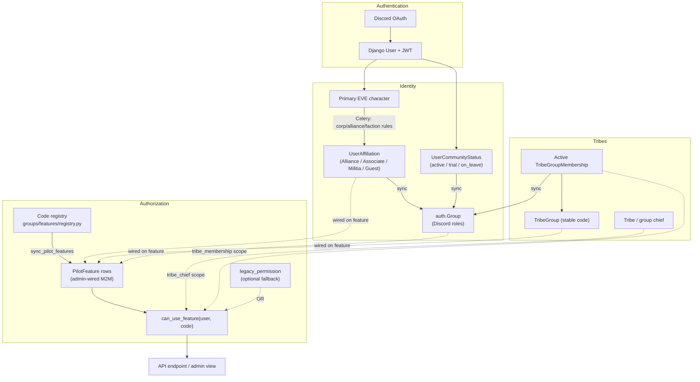

# Auth

How authentication and authorization work on minmatar.org.

| Doc | Covers |
|-----|--------|
| [authentication.md](authentication.md) | Discord OAuth login, JWT issuance, `AuthBearer` |
| [authorization.md](authorization.md) | PilotFeature evaluation, scopes, `can_use_feature()`, gating endpoints |
| [feature-catalog.md](feature-catalog.md) | Every feature code, its scope, legacy permission, and default wiring |
| [migration.md](migration.md) | Retiring Django auth-group permissions in favor of feature wiring |

## Overview

Two questions, two systems:

1. **Who are you?** — Authentication. Discord OAuth produces a Django user and a JWT. Every API request carries that JWT.
2. **What can you do?** — Authorization. A single evaluator, `can_use_feature(user, code, **context)`, decides access per capability.

Identity (affiliation, community status, Discord roles) and product capabilities (view fleets, apply to tribes) are separate. Capabilities are **PilotFeatures**: stable codes defined in a code registry and wired in the admin to affiliations, tribe groups, or auth groups.



### Separation of concerns

| Concern | Owned by |
|---------|----------|
| Identity (alliance member, associate, militia, guest) | `AffiliationType` / `UserAffiliation` |
| Discord roles | `auth.Group` |
| Product capabilities (view fleets, submit SRP, …) | `PilotFeature` |

A feature can grant Associates tribe access without giving them Django permissions, or grant Technology Team ops access via an auth group, without conflating those with alliance membership.

### Code map

| Piece | Path |
|-------|------|
| Feature catalog | `backend/groups/features/registry.py` |
| Scope enum | `backend/groups/features/types.py` |
| `PilotFeature` model | `backend/groups/models.py` |
| Evaluator | `backend/groups/helpers/feature_access.py` |
| Sync command | `backend/groups/management/commands/sync_pilot_features.py` |
| Tests | `backend/groups/tests/test_feature_access.py` |

### Deploy

```bash
pipenv run python manage.py migrate
pipenv run python manage.py sync_pilot_features
```

`sync_pilot_features` upserts feature rows from the registry and seeds default M2M wiring only when a feature's sets are empty, so admin overrides are preserved.
