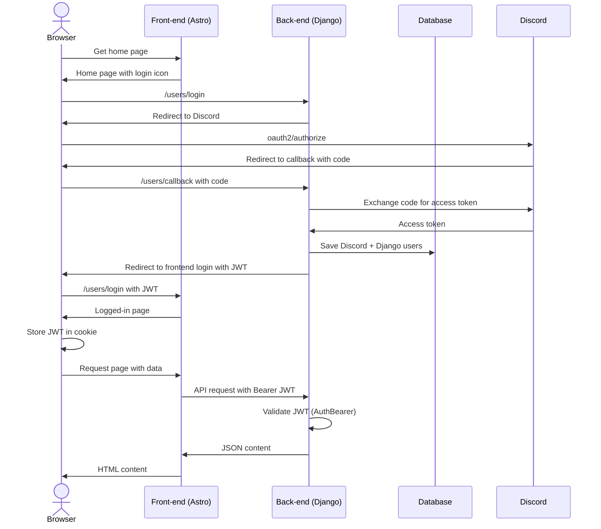

# Authentication

Authentication answers "who are you?" Discord is the identity provider; a JWT carries that identity on each request.

## Login flow

## Components

- **Discord OAuth** — There is no password login. The Discord account creates or links the Django `User`.
- **JWT** (`backend/users/jwt_auth.py`) — Payload includes `user_id`, `username`, `avatar`, and `is_superuser`. The token carries **no permissions or features**; those are evaluated server-side on each request.
- **`AuthBearer`** (`backend/authentication.py`) — Validates the JWT on Django Ninja endpoints and sets `request.user`. `AuthOptional` allows anonymous access where appropriate.
- **EVE characters** — Linked separately via ESI SSO. The **primary character** determines the user's affiliation (see [authorization.md](authorization.md)).

Authentication only identifies the user. Access decisions are authorization.
