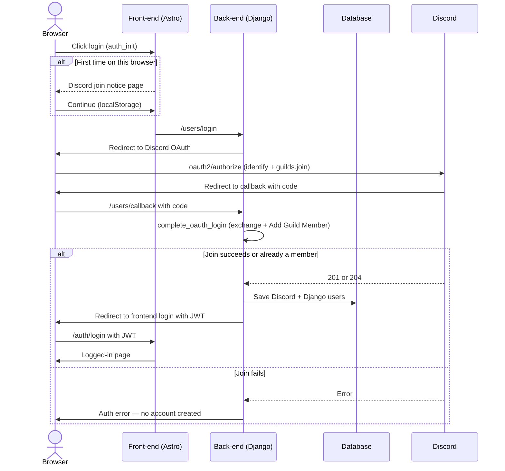

# Authentication

Authentication answers "who are you?" Discord is the identity provider; a JWT carries that identity on each request.

## Login flow

```mermaid
sequenceDiagram
    actor Browser
    participant FrontEnd as Front-end (Astro)
    participant BackEnd as Back-end (Django)
    participant DB as Database
    participant Discord

    Browser->>FrontEnd: Click login (auth_init)
    alt First time on this browser
        FrontEnd-->>Browser: Discord join notice page
        Browser->>FrontEnd: Continue (localStorage)
    end
    FrontEnd->>BackEnd: /users/login
    BackEnd->>Browser: Redirect to Discord OAuth
    Browser->>Discord: oauth2/authorize (identify + guilds.join)
    Discord->>Browser: Redirect to callback with code
    Browser->>BackEnd: /users/callback with code
    BackEnd->>BackEnd: complete_oauth_login (exchange + Add Guild Member)
    alt Join succeeds or already a member
        Discord-->>BackEnd: 201 or 204
        BackEnd->>DB: Save Discord + Django users
        BackEnd->>Browser: Redirect to frontend login with JWT
        Browser->>FrontEnd: /auth/login with JWT
        FrontEnd->>Browser: Logged-in page
    else Join fails
        Discord-->>BackEnd: Error
        BackEnd->>Browser: Auth error — no account created
    end
```

## Discord membership

Login requests OAuth scopes **`identify`** and **`guilds.join`**. `DiscordClient.complete_oauth_login` exchanges the code and calls Discord **Add Guild Member** before creating or linking a site account.

- **Already a member** (HTTP 204) counts as success.
- If Add Guild Member fails, login **does not proceed** and no new site account is created.
- Canceling Discord consent never reaches a successful callback.
- All website login entry points go through `/redirects/auth_init`, a one-time notice (remembered in `localStorage`) explaining that login adds you to Discord and that leaving Discord deletes website data.

## Components

- **Discord OAuth** — There is no password login. The Discord account creates or links the Django `User`, and the user must join the FL33T Discord guild as part of login.
- **JWT** (`backend/users/jwt_auth.py`) — Payload includes `user_id`, `username`, `avatar`, and `is_superuser`. The token carries **no permissions or features**; those are evaluated server-side on each request.
- **`AuthBearer`** (`backend/authentication.py`) — Validates the JWT on Django Ninja endpoints and sets `request.user`. `AuthOptional` allows anonymous access where appropriate.
- **EVE characters** — Linked separately via ESI SSO. The **primary character** determines the user's affiliation (see [authorization.md](authorization.md)).

Authentication only identifies the user. Access decisions are authorization.
