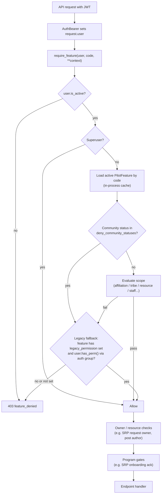
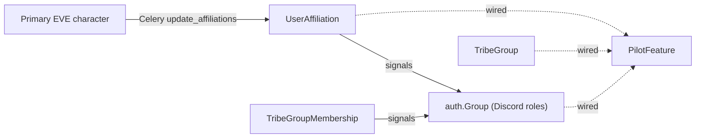

# Authorization

Authorization answers "what can you do?". Product access goes through one evaluator:

```python
from groups.helpers.feature_access import can_use_feature, require_feature

# boolean check
if can_use_feature(request.user, "fleets.view", fleet=fleet):
    ...

# Ninja endpoint gate: returns (403, {"detail": "feature_denied", "feature": code}) or None
denied = require_feature(request.user, "tribes.apply", tribe_group=tribe_group)
if denied:
    return denied
```

Endpoints should use these helpers rather than `user.has_perm(...)`. To add a capability, register it and gate with `require_feature` (see [Gating a new endpoint](#gating-a-new-endpoint)).

## Request lifecycle



After the feature gate, the endpoint still owns:

1. **Owner/resource checks** — e.g. only the SRP request owner or a processor can see a request; only the post author can edit it.
2. **Program gates** — e.g. SRP onboarding acknowledgment (`onboarding/srp_gate.py`).

## Catalog and database

Features are **defined in code** and **wired in the admin**:

| Piece | Location | Purpose |
|-------|----------|---------|
| `FeatureDefinition` | `backend/groups/features/registry.py` | Source of truth: stable `code`, `scope`, optional `legacy_permission`, default wiring hints |
| `PilotFeature` | `backend/groups/models.py` | DB row synced from the registry; admins wire M2M to `AffiliationType`, `TribeGroup`, `auth.Group` |
| `sync_pilot_features` | management command | Upserts rows from the registry; seeds default M2M **only when empty** |

Adding a feature is a registry entry, a deploy sync, and admin wiring. Deactivating a feature (`is_active=False`) removes it from evaluation without deleting the row.

### Evaluation

A non-superuser is allowed when **either**:

- the feature's **scope** evaluates true for the user (and optional resource context), or
- the user holds the feature's **`legacy_permission`** (optional Django permission fallback)

Inactive users are always denied, including superusers. Pass `allow_legacy=False` to ignore the legacy fallback (useful when verifying that wiring alone is sufficient).

## Scopes

The `scope` on a feature selects the evaluation strategy (`backend/groups/features/types.py`):

| Scope | Grants access when | Example features |
|-------|--------------------|------------------|
| `affiliation` | User's `UserAffiliation` is one of the feature's wired `AffiliationType` rows | `fleets.create`, `srp.view`, `structures.view`, `mumble.access` |
| `tribe_group_target` | Affiliation matches **and** the target `TribeGroup` (passed as `tribe_group=`) is in the wired set — empty set means all tribe groups | `tribes.apply` |
| `tribe_chief` | User is a tribe or group chief (of the target `tribe_group=`/`tribe=` if passed, otherwise of any wired tribe group); the feature's staff/legacy permission also grants | `tribes.manage_memberships`, `industry.order.submit` |
| `tribe_membership` | User has an active `TribeGroupMembership` in a wired tribe group | (available for wiring) |
| `resource_match` | User's auth groups overlap the resource's audience groups (e.g. `fleet.audience.groups`), or affiliation matches | `fleets.view`, `srp.submit` |
| `auth_group` | User is in one of the wired `auth.Group` rows | `tech.ops` (Technology Team) |
| `staff` | User holds `staff_permission` (or the legacy permission) | `srp.process`, `applications.manage`, `moons.manage` |

Context kwargs (`fleet=`, `tribe_group=`, `tribe=`) are consumed by the relevant scope:

- `tribe_group_target` requires a target; without it, access is denied
- `resource_match` without a fleet falls back to an affiliation check
- `tribe_chief` without a target checks chief-ship of any wired tribe group

Pass the resource whenever you have it.

### Evaluator details

Implementation: `backend/groups/helpers/feature_access.py`.

- **Unknown or inactive feature codes** fall back to the registry definition's `legacy_permission` if present; otherwise deny.
- **Feature rows are cached in-process.** Wiring changes take effect on worker restart (or `clear_feature_cache()` in tests).

### Community status

Each feature carries `deny_community_statuses` (default: `["on_leave"]`). A matching `UserCommunityStatus` fails scope evaluation; the legacy permission fallback may still grant access. `tech.ops` uses an empty deny list so tech staff keep access while on leave.

## Identity inputs



- **`AffiliationType`** (Alliance, Militia, Associate, Guest) — identity bucket derived from the primary character's corp/alliance/faction by a scheduled Celery task. Features reference affiliations; affiliations do not grant product access by themselves.
- **`TribeGroup.code`** — stable key (`industry.mining`, `capitals.dreads`, …) used in feature wiring and reports.
- **`auth.Group`** — primarily Discord role mapping; also usable as a feature wiring target (e.g. Technology Team). Some groups may still hold Django permissions used as `legacy_permission` fallbacks (see [migration.md](migration.md)).

### Tribe offboarding

When affiliation changes, signals re-evaluate `tribes.apply`. Users who no longer qualify have tribe memberships inactivated (`tribes/helpers/offboarding.py`). A Celery task (`remove_tribe_members_without_permission`) runs the same check as a safety net.

## Gating a new endpoint

1. Add a `FeatureDefinition` to `backend/groups/features/registry.py` if the capability is new. Use a stable `code` (`app.action`), pick a scope, and set `legacy_permission` only when an existing Django permission should remain a fallback.
2. Run `pipenv run python manage.py sync_pilot_features` (also part of deploy).
3. Wire affiliations / tribe groups / auth groups in Django admin → **Groups → Pilot features**.
4. In the endpoint, call `require_feature(request.user, "app.action", **context)` and return the result if truthy.
5. Add tests in `backend/groups/tests/test_feature_access.py` and/or the app's endpoint tests.

## Admin panel

| Admin area | Role |
|------------|------|
| **Groups → Pilot features** | Wire affiliations, tribe groups, auth groups, deny statuses; activate/deactivate |
| **Affiliation types** | Identity rules (priority, corporations, alliances, factions) |
| **Auth groups** | Discord role mapping; optional Django permission assignments for legacy fallback |
| **Tribes / tribe groups** | Chiefs and membership management |

Custom staff admin views (industry orders, doctrines, tribes, onboarding, help tickets) use `user_has_legacy_perm()` and `can_use_feature()` where a matching staff feature exists.

## Frontend

The frontend reads Django permission strings from the user profile:

- `GET /api/users/me` returns `permissions: string[]` from `user.get_all_permissions()`.
- Astro pages check those strings (e.g. `user_permissions.includes('fleets.view_evefleet')`).

PilotFeature codes are not yet exposed to the frontend. Nav and page gating therefore still depend on Django permissions held by auth groups. Exposing feature codes on the profile API is the path to frontend-side feature checks (see [migration.md](migration.md)).

## Testing

```bash
cd backend
pipenv run python manage.py test groups tribes fleets srp --settings=app.settings_test
```

Evaluator tests live in `backend/groups/tests/test_feature_access.py` and use synthetic users only.
