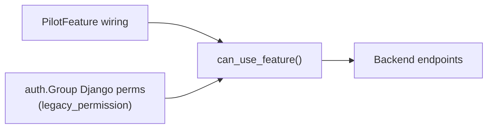

# Retiring legacy permissions

Some PilotFeatures still list a `legacy_permission`. The evaluator treats that as an OR with scope evaluation, so auth-group Django permissions (notably on the Alliance group) continue to grant access alongside feature wiring.

This document is the runbook for removing that fallback once wiring is the sole source of truth.

## Dual path

Backend endpoints already call `can_use_feature` / `require_feature`. Frontend page gating still reads Django permission strings from `/api/users/me`.

## Steps

1. **Confirm admin wiring** — for each feature, affiliations / tribe groups / auth groups match the intended audience.
2. **Verify parity** — compare legacy grants against scope-only grants (`allow_legacy=False`) for representative user archetypes before stripping anything.
3. **Expose features to the frontend** — until `/api/users/me` (or equivalent) returns feature codes and Astro checks them, stripping Alliance group permissions will break frontend nav gating even if the backend is correct.
4. **Strip auth-group permissions** — remove the Django model permissions from groups that no longer need them.
5. **Clear `legacy_permission`** — remove it from registry entries one feature at a time, re-run `sync_pilot_features`, and verify.
6. **Clean up** — drop unused permission assignments and any remaining `user_has_legacy_perm` call sites that are obsolete.

## Conventions

- New capabilities should not set `legacy_permission`; wire the feature instead.
- Do not add Django permissions to auth groups to grant product access — wire the feature.
- Do not strip Alliance (or other) group permissions until frontend gating has a non-permission source of truth.

## Rollback

Re-add `legacy_permission` on the registry entry, re-run `sync_pilot_features`, and ensure the permission is still assigned on the relevant auth group.
