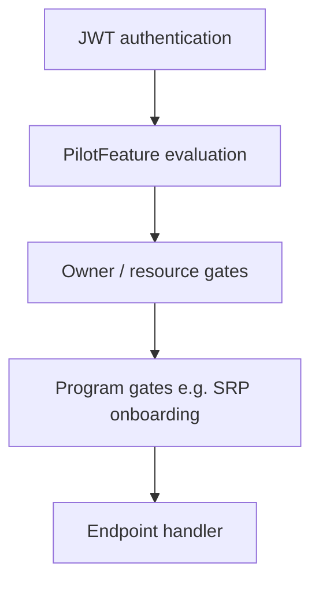

# Authorization

Minmatar.org uses a layered authorization model. Pilot-facing capabilities are moving from Django auth-group permissions to **PilotFeature** wiring, while legacy permissions remain supported during migration.

## Layers



1. **Authentication** — `AuthBearer` validates JWT; identifies `request.user`.
2. **PilotFeature** — `can_use_feature(user, code, **context)` decides if the user may use a capability.
3. **Owner/resource gates** — e.g. SRP request owner, fleet creator, post author (checked after feature access).
4. **Program gates** — e.g. SRP onboarding acknowledgment (`onboarding/srp_gate.py`).

## Backend

### Feature catalog vs database

| Piece | Location | Purpose |
|-------|----------|---------|
| `FeatureDefinition` | [`groups/features/registry.py`](../backend/groups/features/registry.py) | Code-defined features (stable `code`, scope, legacy permission) |
| `PilotFeature` | [`groups/models.py`](../backend/groups/models.py) | DB row synced from registry; admins wire affiliations, tribe groups, auth groups |
| `sync_pilot_features` | management command | Upsert features from registry; seed default M2M when empty |

### Single utility

All product authorization should use [`groups/helpers/feature_access.py`](../backend/groups/helpers/feature_access.py):

```python
from groups.helpers.feature_access import can_use_feature, require_feature

if not can_use_feature(request.user, "fleets.view", fleet=fleet):
    return require_feature(request.user, "fleets.view", fleet=fleet)

# Ninja helper
denied = require_feature(request.user, "tribes.apply", tribe_group=tg)
if denied:
    return denied
```

**Evaluation order (non-superuser):**

1. Inactive users → deny
2. Community status in `deny_community_statuses` → scope denied; legacy permission may still grant access
3. Scope evaluation (affiliation, tribe chief, resource match, etc.)
4. **Legacy fallback** — `legacy_permission` on the feature (backwards compatible with Alliance auth-group perms)

Superusers always pass.

### Scopes

| Scope | Checks |
|-------|--------|
| `affiliation` | `UserAffiliation` in feature's wired `AffiliationType` rows |
| `tribe_group_target` | Affiliation + target `TribeGroup` in wired set (`tribes.apply`) |
| `tribe_chief` | User is tribe or group chief (optional wired tribe groups) |
| `tribe_membership` | Active `TribeGroupMembership` in wired groups |
| `resource_match` | User auth groups overlap `fleet.audience.groups`, or affiliation match |
| `auth_group` | User in wired auth groups (e.g. Technology Team) |
| `staff` | `staff_permission` or legacy permission |

### TribeGroup and AffiliationType

- **AffiliationType** — identity bucket (Alliance, Militia, Guest, Associate). Assigned from primary character rules via Celery; drives auth groups for Discord.
- **TribeGroup.code** — stable key (`industry.mining`, etc.) used in feature wiring and reports.
- **Offboarding** — when affiliation changes, users who lose `tribes.apply` are inactivated from tribe memberships (`tribes/helpers/offboarding.py` + Celery safety task).

### Gating a new endpoint

1. Add a `FeatureDefinition` to the registry (if new capability).
2. Run `pipenv run python manage.py sync_pilot_features`.
3. Wire affiliations/tribe groups in Django admin → Pilot features.
4. Call `require_feature()` in the endpoint with any required context (`fleet`, `tribe_group`, `tribe`).
5. Add tests in `groups/tests/test_feature_access.py` or the app's endpoint tests.

### Deploy

After migrate:

```bash
pipenv run python manage.py sync_pilot_features
```

## Frontend (unchanged in this work)

The frontend continues to use Django permission strings from the user profile API:

- `GET /api/users/me` returns `permissions: string[]` (`user.get_all_permissions()`).
- Astro pages check `user_permissions.includes('fleets.view_evefleet')` etc.

**PilotFeature codes are not exposed to the frontend yet.** During migration, Alliance group permissions and backend feature checks run in parallel. When legacy perms are removed from auth groups, update frontend checks in a follow-up.

## Administration panel

| Area | Role |
|------|------|
| **Pilot features** | Wire affiliations, tribe groups, and auth groups per feature |
| **Affiliation types** | Define identity rules (corp/alliance/faction); not direct product perms |
| **Auth groups** | Discord roles; Alliance group still carries legacy Django perms until stripped |
| **Tribes / tribe groups** | Chiefs, Discord groups, membership approve/deny unchanged |

Staff admin custom views use `user_has_legacy_perm()` and `can_use_feature()` where a matching staff feature exists (industry orders, doctrines, tribes, onboarding).

## Migration path

1. **Now** — features grant access via scope **or** legacy permission.
2. **Admin** — wire Associate and other affiliations on features without waiting for Alliance perm strip.
3. **Later** — remove Django perms from Alliance auth group; remove `legacy_permission` from registry entries one feature at a time; re-verify with `allow_legacy=False`.

## Tests

```bash
pipenv run python manage.py test groups tribes fleets srp --settings=app.settings_test
```

Synthetic tests live in `groups/tests/test_feature_access.py`. They do not use production user data.
