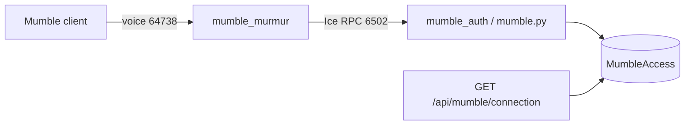

# Mumble / Murmur architecture (removed)

Alliance voice is Discord. This document describes the Mumble stack that used to run in production so the underlying pieces (Murmur, ZeroC Ice, credential store) are understandable if we ever need them again.

Code lived under `backend/mumble/`, `backend/mumble.py`, and `backend/Dockerfile.mumble` before hard deletion; recover from git history on the parent of the removal commit if needed. Frontend connect UI was removed earlier (#2535).

## Murmur (Mumble server)

- **Image**: `mumblevoip/mumble-server:v1.4.230-6` as Compose service `mumble_murmur`, hostname `murmur`.
- **Voice plane**: TCP/UDP **64738** (client connections).
- **Control plane**: Ice listen on **6502** (`ice="tcp -h 0.0.0.0 -p 6502"` in `murmur.ini`).
- **Config**: custom `murmur.ini` mounted at `/data/murmur.ini` via `MUMBLE_CUSTOM_CONFIG_FILE`. Also set public register name/URL (`Minmatar Fleet`, `https://my.minmatar.org/`).
- **State**: Docker volume `murmur_data`.
- Not started in local `docker-compose.yml` / CI — production compose only.

## ZeroC Ice and the Murmur slice

Murmur exposes an RPC API over [ZeroC Ice](https://zeroc.com/products/ice). The API is defined by the Slice file `Murmur.ice` from the mumble-voip **1.4.x** tree.

The auth container (not the main Django image) was responsible for Ice tooling:

1. `pip install zeroc-ice`
2. Download `Murmur.ice` from the upstream 1.4.x branch
3. Run `slice2py` to generate the Python `Murmur` module

`zeroc-ice` was **not** in the main Pipfile; only `Dockerfile.mumble` needed it.

Runtime bootstrap in the authenticator process:

1. `Ice.initialize(sys.argv)`
2. Proxy string `Meta:tcp -h murmur -p 6502`
3. `Murmur.MetaPrx.checkedCast(...)` → `meta.getServer(1)` (virtual server id `1`)
4. Create an object adapter (`Callback.Client` on `tcp -h 0.0.0.0 -p 6502`) so Murmur can call back into our servants
5. Register servants and block on `ice.waitForShutdown()`

## Custom Ice authenticator

A separate long-running process (`mumble_auth`, command `python3 mumble.py`) — not a Django HTTP view. It called `django.setup()` only so the ORM could read credentials from the shared database.

| Servant | Role |
|---------|------|
| `Murmur.MetaCallback` | Logged server started/stopped |
| `Murmur.ServerAuthenticator` | Custom login; registered via `server.setAuthenticator(...)` |

### `authenticate(name, pw, certificates, certhash, certstrong)`

Murmur invoked this on client connect:

1. Deny hardcoded `SuperUser` (return `-1`)
2. Look up `MumbleAccess` by `username == name`
3. Deny if missing or `suspended`
4. Compare **plaintext** password to the stored value
5. On success return `(django_user.id, "[FL33T] " + name, django_group_names)` — session user id, display name, and Mumble group memberships derived from Django `User.groups`

Other authenticator methods (`getInfo`, `nameToId`, `idToName`, `idToTexture`) were stubs and unused in practice.

## Django credential store and API

### Model `MumbleAccess`

- One-to-one with Django `User`
- `username`: primary Eve character name (unique)
- `password`: random 20-character alphanumeric, stored **plaintext** (required for Ice authenticator comparison)
- `suspended`: soft block without deleting the row

Credentials were minted on demand via the API (`get_or_create`), not reliably via signals (`MumbleConfig.ready()` historically imported the wrong signals module).

### HTTP API

`GET /api/mumble/connection` (Django Ninja, bearer auth):

- Gated by feature `mumble.access` (affiliation Alliance / Associate; legacy permission `mumble.view_mumbleaccess`)
- Required a primary character
- Returned `{ username, password, url }` where `url` was `mumble://{character}:{password}@{MUMBLE_MURMUR_HOST}:{MUMBLE_MURMUR_PORT}`

Env: `MUMBLE_MURMUR_HOST`, `MUMBLE_MURMUR_PORT` (client-facing host/port for the deep link, distinct from the internal Ice hostname `murmur`).

### Celery

- `set_mumble_usernames` — daily beat task; kept `MumbleAccess.username` aligned with the user’s primary character
- `clear_unauthorized_mumble_access` — set `suspended=True` when the user lost `mumble.access`; **never scheduled** on beat

## Frontend consumer (already removed)

The site previously fetched connection info and launched the client via the `mumble://` URL (download link, connect/launch buttons, credentials dialog). That UI was removed in #2535; leftover i18n/types were cleaned up with the backend removal. Voice guidance in player docs points at Discord.

## Related paths (historical)

| Path | Piece |
|------|--------|
| `backend/mumble/` | Django app (model, router, tasks, admin, `murmur.ini`) |
| `backend/mumble.py` | Ice authenticator entrypoint |
| `backend/Dockerfile.mumble` | Auth image: Ice + slice2py + Django deps |
| `docker-compose-prod.yml` | Services `mumble_murmur`, `mumble_auth`, volume `murmur_data` |
