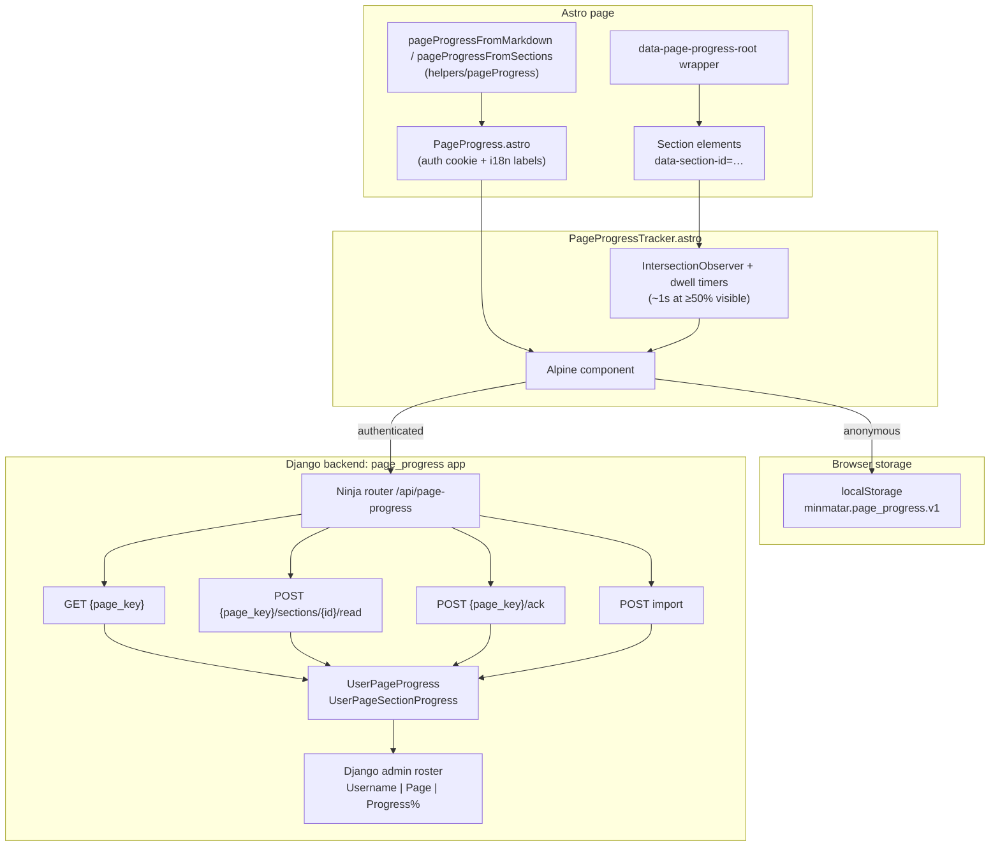
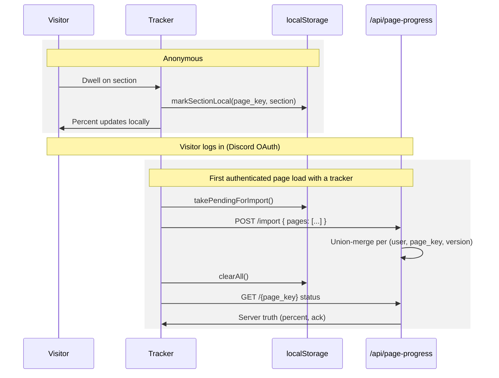

# Page Progress — Architecture

How the page progress feature is put together end to end: what lives in the browser, what lives on the server, and how anonymous progress becomes user progress on login.

For "how do I add this to my page", see [frontend.md](frontend.md).

## Design principles

- **Generic, not guide-specific.** Any page can participate by supplying a `page_key` (e.g. `guides/bookmarks`, `alliance/values`). There is no page registry in the database; the frontend is the source of truth for what a page's sections are.
- **Frontend supplies the manifest.** Each page declares its `page_key`, `page_title`, `version` (content hash), and `section_ids`. The backend just records what it is told, per user.
- **Passive progress + optional explicit ack.** Sections are marked read by dwell (sustained visibility), and a page can additionally require a "Mark as read" acknowledgement.
- **Anonymous-friendly.** Logged-out visitors get the same UI backed by localStorage. Nothing is written server-side until they authenticate, at which point the stash is union-merged into their account.

## Component overview

## Frontend

### Manifest helpers — `frontend/app/src/helpers/pageProgress/`

| Module | Responsibility |
|--------|----------------|
| `manifest.ts` | `pageProgressFromMarkdown` (parses `##` headings into sections + tagged HTML) and `pageProgressFromSections` (explicit section lists). Both produce `{ page_key, page_title, version, section_ids }`. |
| `sections.ts` | Slugification, `##` heading extraction, `hashPageVersion` (sha256 prefix of content). |
| `markdown.ts` | `parseMarkdownWithSections` — marked renderer that stamps `id` + `data-section-id` on every `h2`. |
| `dwellObserver.ts` | Dwell constants and pure visibility/timer logic (`DWELL_MS` = 1000, `VISIBLE_RATIO` = 0.5), unit-tested in isolation. |
| `localStore.ts` | Anonymous stash: load/mark/ack per page, version-mismatch discard, `takePendingForImport`, `clearAll`. |
| `index.ts` | Public barrel — pages import from `@helpers/pageProgress`. |

### Components

- **`PageProgress.astro`** — the only component pages mount. Reads the `auth_token` cookie server-side, resolves i18n labels, and renders the tracker whenever `section_ids` is non-empty (signed in or not).
- **`PageProgressSection.astro`** — sugar for `<section id data-section-id>` when marking sections in custom layouts.
- **`PageProgressTracker.astro`** — internal Alpine component. Owns the IntersectionObserver, dwell timers, percent state, ack button, and all storage/API calls.

### Read detection (dwell)

A section is credited when it stays sufficiently visible for a continuous dwell period:

- ≥50% of the section on screen (or, for sections taller than the viewport, the section covering ≥50% of the viewport), sustained for ~1 second.
- Timers are cancelled when the section leaves the threshold, so fast scrolling and TOC jumps do not inflate progress.
- Visibility is re-checked when the timer fires before anything is recorded.

## Backend — `backend/page_progress/`

Two models, keyed by `(user, page_key, version)`:

- **`UserPageProgress`** — one row per user/page/version: `page_title`, `section_total`, `started_at`, `last_seen_at`, `acknowledged_at`. `percent` is derived (`read_count / section_total`).
- **`UserPageSectionProgress`** — one row per read section: `section_id`, `first_seen_at`, `last_seen_at`. Unique per `(user, page_key, section_id, version)`.

Endpoints (all bearer-auth, Ninja router mounted at `/api/page-progress`; `{path:page_key}` allows slashes):

| Endpoint | Purpose |
|----------|---------|
| `GET /{page_key}?version=&sections=` | Status: read/missing sections, percent, ack state. |
| `POST /{page_key}/sections/{section_id}/read` | Idempotent section read (creates parent progress row as needed). |
| `POST /{page_key}/ack` | Acknowledge; rejected while any supplied section is unread. |
| `POST /import` | Bulk union-merge of client-side (anonymous) progress; capped pages/sections per request. |

**Versioning:** the version is an opaque content hash from the frontend. New content ⇒ new version ⇒ fresh progress; old rows are retained but no longer surfaced.

**Admin:** `UserPageProgress` renders the Username | Page | Progress% roster; the detail view embeds a condensed sections-read table. The section model has no separate admin entry.

## Anonymous tracking and merge on login

Anonymous progress never touches the database — it lives in one localStorage blob (`minmatar.page_progress.v1`) mapping `page_key` to `{ version, page_title, section_total, read_sections, is_acknowledged, updated_at }`.

Merge semantics (`import_page_progress` in `helpers.py`):

- **Union** of section ids — existing server sections are never deleted.
- `section_total` = max(existing, incoming).
- `acknowledged_at` set if either side acknowledged; an existing server ack timestamp is kept.
- Stale local entries (version mismatch with the current page) are discarded client-side before import.
- Limits: 50 pages per import, 200 sections per page.

The merge is triggered lazily by the tracker rather than a login hook: the first authenticated page that mounts a tracker flushes the whole stash. This covers the OAuth-return flow without touching authentication code.

## Data flow summary

| Visitor state | Reads/acks go to | Status comes from |
|---------------|------------------|-------------------|
| Anonymous | localStorage | localStorage |
| Just logged in (stash present) | import → server | server (after import) |
| Authenticated | server | server |

## Key files

| Area | Path |
|------|------|
| Helpers barrel | `frontend/app/src/helpers/pageProgress/index.ts` |
| Anonymous stash | `frontend/app/src/helpers/pageProgress/localStore.ts` |
| Dwell logic + tests | `frontend/app/src/helpers/pageProgress/dwellObserver.ts`, `frontend/app/testing/helpers/dwellObserver.test.ts` |
| UI components | `frontend/app/src/components/blocks/PageProgress.astro`, `PageProgressSection.astro`, `PageProgressTracker.astro` |
| API client | `frontend/app/src/helpers/api.minmatar.org/pageProgress.ts` |
| Models / helpers | `backend/page_progress/models.py`, `backend/page_progress/helpers.py` |
| Endpoints | `backend/page_progress/endpoints/` |
| Admin | `backend/page_progress/admin.py` |
| Tests | `backend/page_progress/tests/test_api.py` |
